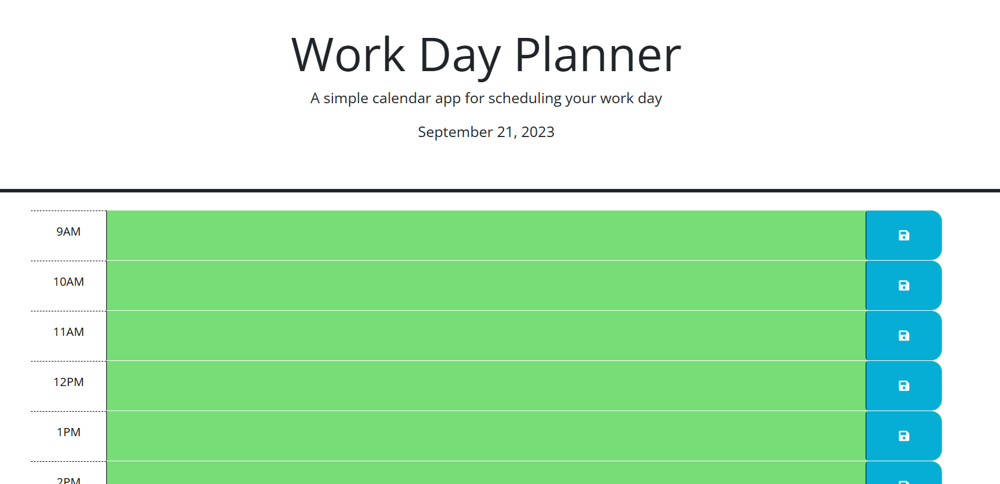

# Work-day-planner

A simple daily planner web application for scheduling your workday. This application allows you to create, save, and manage your daily tasks during standard business hours.

## Features

- Display the current day at the top of the calendar.
- Scrollable time blocks for standard business hours (9am to 5pm).
- Color-coded time blocks to indicate whether they are in the past, present, or future.
- Ability to enter and save events in each time block.
- Persistent storage of saved events in local storage.
- Automatic refresh to update time block colors based on the current time.

## Getting Started

Follow these instructions to get a copy of the project up and running on your local machine.

## Prerequisites

To run this project, you will need the following software installed on your machine:

- Web browser (e.g., Chrome, Firefox)

## Website : 
To access the work day planner: 

